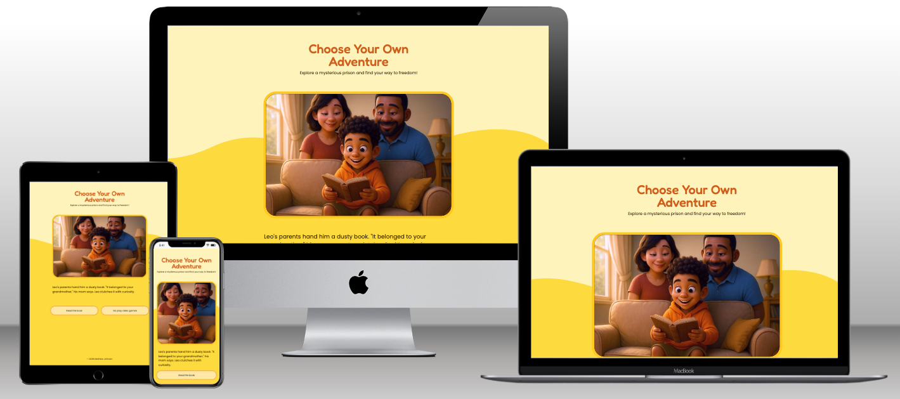
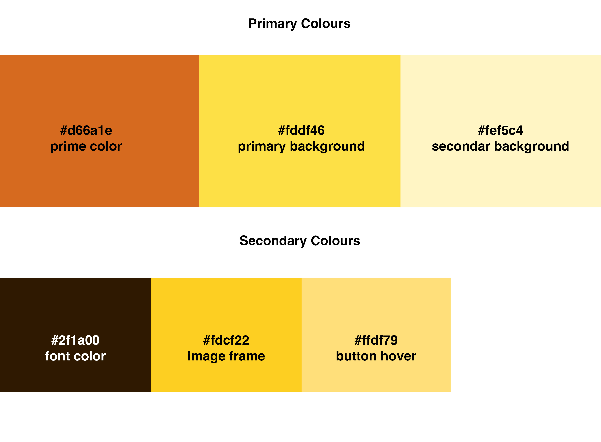
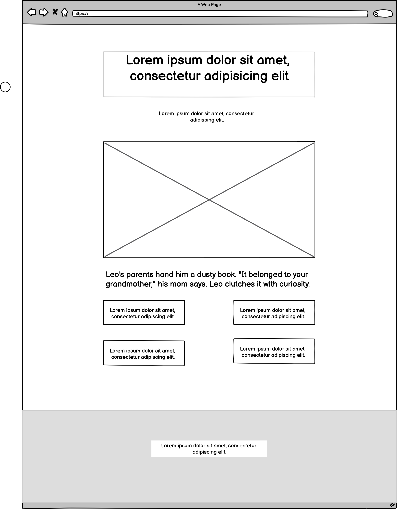
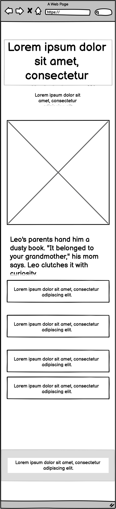
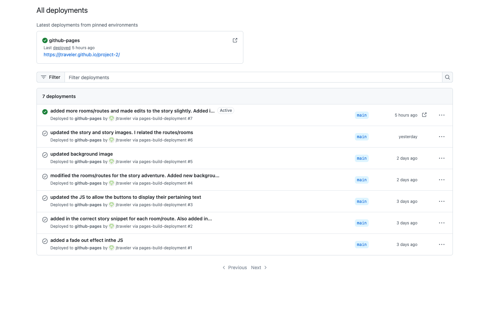

# project-2

# Leo and the Magical Book

Project 2 - Matthew Johnson

[View live github project](https://jtraveler.github.io/project-2/)

# Leo and the Magical Book

For this project, I was inspired by my love for the Choose Your Own Adventure book series that I used to love readig as a ki. I was always facinated that a story could go in different directions with different outcome based on your decisions. And most recently I was reading about Netflix's Black Mirror series where I beleive one of the episodes had an alternate ending, and that made me think of the Choose Your Own Adventure book series. Furthormore, my 4 year old son inspired me for this project as he's an adventurous kid with always exploring things. Also I captured similar likeness for the lead character, Leo. Therefore for this project I'm very pleased that I can impliment my new skills learned for Javascript, create my own interactive children's story, and lastly sort of having my son be the lead character.

## About 'Leo and the Magical Book'

The reader/user takes on the role as Leo, a curiius boy who is 12 years old. As the user is reading the story, they decide where Leo goes, his actions and what knowledge that they seek. In additon lessons and skills can be learned along the way such as courage, selflessness, kindness and wisdom.

The story begins with Leo's parents giving him mysterious old children's book that they found when clearing out his grandmother's, as she had recently passed away. Leo is instantly intrigued by the book and if the user decides, the book can transport Leo to a magical land. Once transported to the land, Leo can explore and interact with different characters along his journey along with having choices to make. I also wanted this experience to be a learning lesson for kids to learn to follow your heart, trust and to be empathetic towards others. Of course the user can completely ignore such lessons along the way as they could be cold or warm based on their descisions, the beautiful thing is that the choise is theirs to make. 

## Table of Contents

1. [UX](#user-experience-ux)
   - [User Story](#user-stories)
   - [A Children's Interactive Concept](#new-clients-and-more-podcast-listeners)
2. [Design](#design)
   - [Wireframes](#wireframes)
3. [Illustrations](#illustrations)
4. [Deployment](#deployment)
5. [Features](#features)
6. [Technologies Used](#technologies-used)
7. [Credits and Reference](#credits-and-reference)

## User Experience UX

### User Story

The client, Explore My Way Games (fictional company) wants to create an interactive children's Choose Your Own Adventure game that will be totally interactive. Ideally this experience will be for kid's between 5-12 and it should be very simplistic and straight forward, so no complex controls and hardly any intructions as everything should be intuative. Also at this phase of building the experience, there should not be any score, sounds, animations etc as the core focus is proof of concept with engaging storytelling. 

Furthermore, Explore My Way Games wants to show diversity within the characters especially with the lead character, Leo as he is mixed race. Through otu the journey the user will interactive with diverse people and interesting creatures.

Not all stories have happy or expected endings and that is the notion that Explore My Way Games invites the user to find out on their own. Regardless of what the user chooses, the over all experience should be relaxed so the user can go at their own pace.

### A Children's Interactive Concept

The question is how to not just have a typical online book for users to read but how to get users engaging with the book with exploring dynamic stories. And most importantly is this something that users want.

According to the fictional task that we conducted on the behalf of Explore My Way Games, out of the 2237 users serveyed, 80% of them love the concept of interactive stories as they are also familiar with gaming concepts. Based on this fictional survey ans dictional data, Explore My Way Games approved the project.

What Explore My Way Games hopes to achieve with this interactive experience:

- Having engage users
- If the response goes well for 'Leo and the Magical Book', they will continue this storyline and develope more interactive onlin e books.
- If the this story gets a certain amount of interactions, they will create an ap for interactive books
- Merch will eventually be created if this project is a hit

## Design

The web interface is incredibly simple with being just one page. The power of JavaScript will allow us to tell the story in one place wihtout having the user be taken to different pages. Also, the website need to be responsive.

The UX controls are simplistic with presenting users up to 4 options to choose from. Why a maximum of 4, you may ask. Well based on the fictional data I collected from the fictional survey, it turns out users get quickly overwelmed when there are more than 4 options. In fact, in some cases it's encouraged to have a maximum of 3 options.

The look and feel has a smooth children's website vibe with using playful fonts and colors. Users should instantly get playful vibes upon arrival with seeing a more brighter color pallete and style.

### Brand Colours

## Wireframes

### Desktop Wireframes

### Mobile Wireframes

## Illustrations

At the core of our story telling is the illustration style and consistent characters. I was going for a 3D Disney Pixar style that is modern and allows the characters features to really be unique. For this I used ChatGPT 4o, which just came out. I figure this is the perfect opportunity to use the new graphic generator features within ChatGPT 4o. 

Though it definitely was not an easy process as it was a very time consuming process. I have to admit it was extremely challenging getting consitent characters with each image generation and I had to color correct each image as well as having to make corrections within Photoshop. Though despite the post editing and re-generating, it all came down to prompt engineering to get the images I was seeking and to be able to talk the ChatGPT 4o LLM. And in the process I learned alot so that I could better improve my prompt engineering techniques this particular LLM.

## Deployment

I used Github deploy my project.

### My Repository

1. I created a new local repository on on Github

2. I committed each major change to ensure I could always look back on it in case I needed to reference the history of my work. I added a detailed message for each commit.

### Hosting

1. On Github, I sslected repository name for this project.

2. I went to Settings and then Pages

3. I was careful to make sure I had the following settings in place:
   - Source: Diploy from branch
   - Branch: Main | Root
   - Lastely I clicked on the save button

4. This had taken a few minutes to setup. Now when I push each change, it will displayed within my live url within minutes automatically.

Examples of getting my local files to my Github repository:

- git add .
- git commit -m "I made this update and this is why this change is important"
- I then used the 'git push' command to push to the live website.

### Deployment on Github

## Features

The features for this website are very simplistic in theory but makes a huge impact on providing a smooth user experience. Users can go places in a non-linear way in simplistic fashion. And the code is set up to easily edit and add story routes as needed in a very simple way.

### Room-Based Navigation System

This feature manages the movement between different story locations or "rooms." (routes)

function move(destination) {
    // Update the current room
    currentRoom = destination;
    // Update the game display for the new room
    gameMaster();
}

### Directional Navigation with Dynamic Buttons

Allows movement in north, south, east, west directions with context-sensitive button text.

if (rooms[currentRoom].north != -1) {
    // There is an exit to the north
    north_shell.style.display = "flex"; // Make button visible
    // Update the north button with the custom text
    north.innerText = rooms[currentRoom].buttonText.north;
    // When clicked, move to the room in that direction
    north.addEventListener('click', () => move(rooms[currentRoom].north));
}

### Story Content Organization

Organizes all story content in a structured array of room objects.

const rooms = [
  {
    id: 0,
    name: "The Book",
    description: `Leo's parents hand him a dusty book...`,
    north: 1,
    south: 3,
    east: 27,
    west: -1,
    buttonText: {
      north: "Read the book",
      south: "Go play video games",
      east: "shortcut to 27"
    },
    media: {
      type: "image",
      src: "assets/images/story-route-0.jpg",
      alt: "Leo receives his grandmother's glowing book..."
    }
  },
  // More rooms...
];

### Adding a Transition Fade Effect on the Images

Displays images with fade-in/fade-out transitions when moving between rooms and also when page loads.

function updateRoomMedia(roomId) {
  // Get the current room
  const room = rooms[roomId];
  
  if (room.media && room.media.type === "image") {
    // Create an image element
    const img = document.createElement('img');
    // Set the attributes for the image
    img.src = room.media.src;
    img.alt = room.media.alt || 'Room image';
    // Start with fade-out applied (invisible)
    img.classList.add('fade-out');
    // Add it to the container
    roomMedia.appendChild(img);
    // Force browser to recognize the initial state
    void img.offsetWidth;
    // Remove fade-out to trigger transition to visible
    img.classList.remove('fade-out');
  }
}

### Smart Button Handling

Prevents multiple event listeners by replacing buttons with clones.

function replaceButton(button) {
  const newButton = button.cloneNode(true); // Create an exact copy of the button
  button.parentNode.replaceChild(newButton, button); // Replace the old button with the new
  return newButton; // Return the new button to use
}

### Story Conductor (GameMaster)

function gameMaster() {
    // Display the current room description
    readDescrption(currentRoom);
    // Update the media for the current room
    updateRoomMedia(currentRoom); 
    // Set up the available exits/buttons
    handleExits(currentRoom);
}

### Room Descriptions and Storytelling

Each room of the game is very unique and carefully crafted to describe what each room is and what it has. All of the rooms play a key part in our storytelling as the user moves from room to room.

javascriptfunction readDescrption(currentRoom) {
    narrator.innerText = rooms[currentRoom].description;
}

### Event Handling for User Interactions

The interactivity is reliant on listening out for button clicks from the user's browser. The following created the interactive portion where the user's decisions influence how Leo's story unfolds.

north.addEventListener('click', () => move(rooms[currentRoom].north));

Credits:

My mentor Spencer Barriball for the encouragment, guidance and helping with the base code concept. 

Man walking created by Sofia Drankovich
(https://lottiefiles.com/free-animation/waling-men-listening-podcast-)

Idle Dog created by Zachary Christensen
(https://lottiefiles.com/free-animation/norm-the-dog-buvwpY646G)

Proud Dog created by Syed Asim Ali Shah
(https://lottiefiles.com/free-animation/dog-walking-7K4JCxjvHm)

Woman kissing do creatd by Sabrina Picco
(https://lottiefiles.com/free-animation/happy-dog-day-AJlBp9pdM7)

Mailing Evelope creatd by GW
(https://lottiefiles.com/free-animation/mail-EjwVwj9a0h)

## Background Pattern

I used a playful paw shape for the background of the headers.

Image created by starline on Freepik
(https://tinyurl.com/mwxwjv6k)

### Navigation Menu

The navigation is very simplistic and and most importantly, responsive. It reflects the branding with displaying the logo and brand colors.

- The navigation on the mobile view is hidden but it's revealed once the user clicks on the hamburger menu icon on the right side.

- The hamburger menu icon is hidden on the tablet and desktop views allowing the user to see all of the menue items at once.

### Mobile Nav Bar

### Desktop Nav Bar

### Icons Used

I used icons from Font Awesome and Freepik

(https://fontawesome.com/)

Stars icons from Freepik

(https://tinyurl.com/jecd6jja)

### Images Used

I used Midjourney for generatying all of the images on the website. I wanted to go for classy studio style images that I could easily cutout the background.

(https://www.midjourney.com/)

Image examples:

### Footer

The footer is simplistic and displays the navigation at all times. I used a footer template from MDG.

- I made sure that the logo is displayed
- A brief paragraph what the company is about
- Navigation link
- Contact information

Credit:

https://mdbootstrap.com/docs/standard/navigation/footer/

## Technologies Used

### Languages

HTML and CSS languages only.

### Technology

Github and Gitpod.

## Credits and Reference

Throughout the website build I used the following sources:

- I used example code from Code Institute projects
- [W3Schools.com](https://www.w3schools.com/)
- [Midjourney.com](https://midjourney.com/) for all images
- [Freepik](https://www.freepik.com/) for favicon design

## Author

Matthew Johnson
# love-maths
